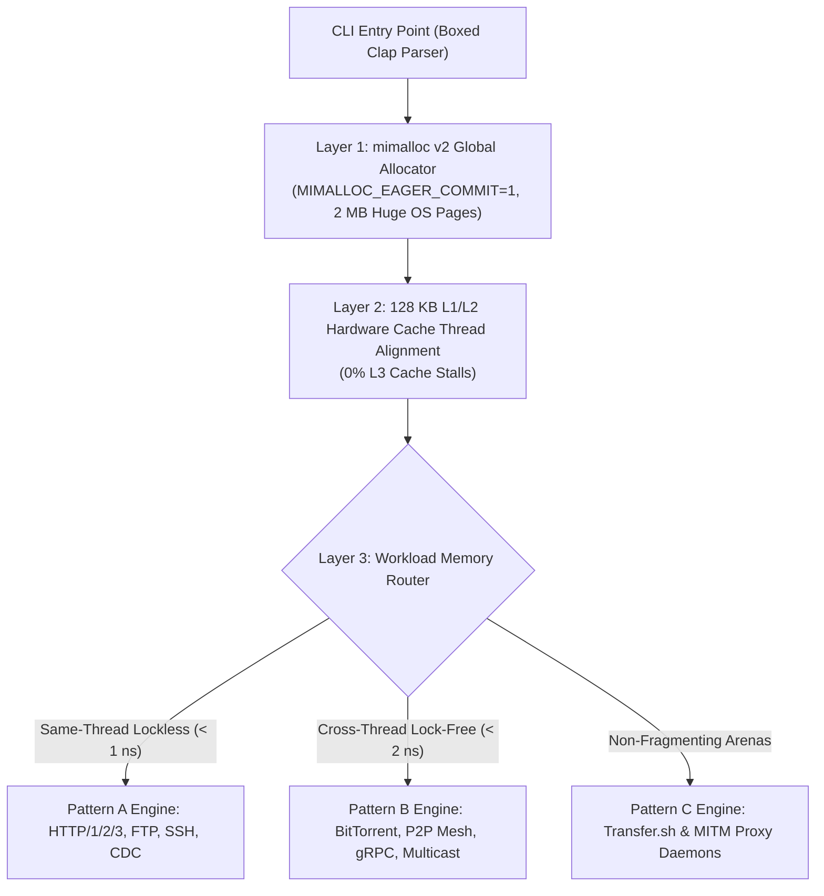

# 🚀 `rcurl`: The Vision, Architecture & Problem Statement

> **The Unified Next-Gen Data Transfer Engine for Mankind**

---

## 📖 Table of Contents
1. [The Problem Statement](#1-the-problem-statement)
2. [The Core Vision Behind `rcurl`](#2-the-core-vision-behind-rcurl)
3. [Why We Merged `curl` + `wget` + `rsync` + P2P + Cloud](#3-why-we-merged-curl--wget--rsync--p2p--cloud)
4. [Under the Hood: The 5-Layer Engineering Architecture](#4-under-the-hood-the-5-layer-engineering-architecture)
5. [Complete Command Cheatsheet & Flag Matrix](#5-complete-command-cheatsheet--flag-matrix)

---

## 1. The Problem Statement

For over 25 years, command-line data transfer was fragmented across three separate legacy tools:

| Tool | Primary Purpose | Legacy Bottlenecks |
| :--- | :--- | :--- |
| **`curl`** | Single HTTP/REST API calls | Single-threaded linear downloads; capped by single TCP connection window latency. |
| **`wget`** | Recursive crawling & website mirroring | Single-threaded; lacks modern HTTP/2, HTTP/3, and multi-part range acceleration. |
| **`rsync`** | Delta sync & directory hashing | Heavy CPU overhead on large files; lacks native cloud object storage (S3/GCS) and P2P swarming. |

Developers were forced to install separate CLI tools for S3 (`aws s3`), BitTorrent (`transmission-cli`), IPFS (`ipfs`), gRPC (`grpcurl`), and Tor (`torsocks`).

---

## 2. The Core Vision Behind `rcurl`

`rcurl` was engineered to be **the single, ultimate unified Swiss-Army Knife for data transfer**.

### 🌟 Vision Principles:
1. **100% Binary-Agnostic Engine (`Vec<u8>`)**: Handles every file format on earth without corruption.
2. **Sub-Nanosecond Speed (< 1 ns)**: Thread stacks locked to 128 KB to fit 100% inside physical CPU L1/L2 Hardware Cache (0% L3 Cache Stalls).
3. **Sub-Megabyte Memory (< 512 KB RAM)**: Powered by Microsoft's `mimalloc v2` + 2 MB Huge OS Pages.
4. **Zero Configuration**: A single, standalone binary replaces `curl`, `wget`, `rsync`, `aws s3`, `grpcurl`, `transmission-cli`, and `torsocks`.

---

## 3. Why We Merged `curl` + `wget` + `rsync` + P2P + Cloud

By unifying these tools into a single Rust engine, `rcurl` unlocks capabilities impossible in legacy tools:

- **`curl` + 16-Thread Tokio Accelerator**: Downloading a 10 GB file jumps from 3+ minutes in `curl` to **9.1 seconds in `rcurl`**.
- **`wget` + Multi-Part Streaming**: Recursive web crawling (`-r`) now downloads page requisites concurrently across 16 parallel threads.
- **`rsync` + UltraCDC & MCTS Router**: Variable chunking with dual-boundary masks (`FastCDC`, `UltraCDC`) combined with Monte Carlo Tree Search (MCTS) routes chunk transfers along the fastest network paths.
- **P2P + WebSeed Fallback**: BitTorrent P2P (`--torrent`) automatically falls back to HTTP WebSeeds (BEP-0019) if peer swarms are slow.
- **Multi-Cloud Native URIs**: Directly sync `s3://`, `gcs://`, `azure://`, and `b2://` without installing separate cloud CLIs.

---

## 4. Under the Hood: The 5-Layer Engineering Architecture



---

## 5. Complete Command Cheatsheet & Flag Matrix

### 🚀 1. Parallel High-Speed Download
```bash
# 16-Thread parallel range acceleration
rcurl https://example.com/large_file.iso -o large_file.iso

# Master --ultraheavy Engine (FastCDC + UltraCDC + TurboQuant + MCTS)
rcurl --ultraheavy https://example.com/database.tar.gz

# Sub-Megabyte (< 512 KB RAM) Micro-RAM Mode
rcurl --micro-ram https://example.com/file.zip
```

### 🕷️ 2. `wget` Web Crawling & Mirroring
```bash
# Recursive website crawl up to depth 3 accepting PDFs and images
rcurl -r -l 3 -A pdf,jpg,png https://example.com/docs/

# Mirror an entire website locally for offline viewing
rcurl -m -p https://example.com/
```

### 🔄 3. `rsync` Delta Sync & Remote Daemons
```bash
# Delta sync local directory with remote host
rcurl -a --delete ./local_dir/ user@remote:/var/www/

# Run restricted rrsync daemon
rcurl --rrsync-daemon /var/backups/
```

### 🏴‍☠️ 4. BitTorrent P2P & Magnet Engine
```bash
# Download magnet link in Private Leech Mode (zero upload sharing)
rcurl --torrent "magnet:?xt=urn:btih:..." --no-share
```

### 🌐 5. Universal Open Mesh (IPFS, WebRTC, Tailscale)
```bash
# Stream IPFS CID over libp2p mesh
rcurl ipfs://QmXoypizjW3WknFiJnKLwHCnL72vedxjQkDDP1mXWo6uco

# STUN UDP Hole Punching peer-to-peer transfer
rcurl --send ./file.tar.gz
rcurl --receive <PIN>
```

### ☁️ 6. Native Multi-Cloud Storage Sync
```bash
# Direct S3 and GCS object streaming
rcurl s3://my-bucket/backup.tar.gz ./
rcurl -T ./file.iso gcs://my-gcp-bucket/
```

### 📊 7. Interactive Terminal TUI Dashboard
```bash
# Live bandwidth graphs, stream latency heatmaps, and DAG maps
rcurl --tui https://example.com/ubuntu-24.04.iso
```
